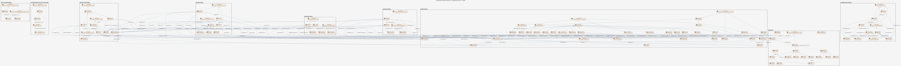

# Produktspesifikasjon: Administrative enheter kommuner

*Datasettet viser kommuneinndelinga i landet med de mest nøyaktige grensene som er registrert digitalt og som er samlet i ett datasett. 
 
Flatene inneholder egenskaper som forteller om offisielle kommunenumre. De offisielle norske, samiske og kvenske navnene for kommunene er hentet fra SSR. I tillegg finnes informasjon om samiske forvaltningsområder.

Geodataene er fra nasjonal inndelingsbase, som er en del av matrikkelen. Ved overgang til ny forvaltningsløsning, ble det også gjort endringer i UML-modellen.

Datasettet har referansedato 1.1.2026, og er oppdatert med overføring av to arealer mellom Indre Østfold og Nordre Follo ved Slemmestadveien, og et areal mellom Indre Østfold og Vestby ved Laaskenveien. Det er i tillegg oppdatert med en del mindre kvalitetshevinger, som følge av jordskiftesaker og klarlegging av eksisterende grense på kommune-/fylkesgrenser.

Datasettet blir oppdatert årlig, og da ved nyttår. Dersom det blir gjort vedtak om grensejustering mellom kommuner etter inndelingsloven med ikrafttredelsesdato underveis i året, blir filene oppdatert rundt ikrafttredelsesdato.*

**Nøkkelord:** Kommune, Administrativ inndeling, Administrative grenser, Kommunegrenser, Fylkesgrenser, Riksgrense, ABAS, Norge fastland, Administrative enheter, Det offentlige kartgrunnlaget, Inspire, geodataloven, Norge digitalt, beredskapsbase, dataNorgeNo, fellesDatakatalog, Basis geodata, Norge

**Emnekategorier:** Administrative grenser

**Geografisk utstrekning**:

- **Vest**: 2.0
- **Øst**: 33.0
- **Sør**: 57.0
- **Nord**: 72.0

**Tidsmessig utstrekning**:

- **Tidsperiode**:
  - **Fra**: 2006-07-01
  - **Til**: 2026-07-30

## Om spesifikasjonen

> **Denne versjonen av produktspesifikasjonen:**  
> **Opprettet dato:** 2006-07-01 
> **Endret dato:** 2026-07-30 
> **Språk:** nor 
> **Kontaktinformasjon:** Kartverket, [post@kartverket.no](mailto:post@kartverket.no)

## Om produktet Administrative enheter kommuner

> **Romlig representasjonstype:** Vektor 
> **Unik identifikator:** <https://data.geonorge.no/sosi/administrativeenheter/kommuner> 
> **Kontaktinformasjon:** Kartverket, [post@kartverket.no](mailto:post@kartverket.no)
>
> **Romlig oppløsning:**
>
> **Ekvivalent målestokk**: 5000
>
> **Begrensninger:**
>
> **Ressursbegrensninger**:
>
> - **Bruksbegrensninger**: Ingen begrensninger på bruk er oppgitt. Se forøvrig lisens.
>
> **Juridiske begrensninger**:
>
> - **Tilgangsbegrensninger**: Åpne data
> - **Bruksbegrensninger**: Lisens
> - **Lisens**: Creative Commons BY 4.0 (CC BY 4.0)
> - **Lisenslenke**: <https://creativecommons.org/licenses/by/4.0/>
>
> **Sikkerhetsbegrensninger**:
>
> - **Klassifisering**: Ugradert

### Formål

Framstille den offisielle kommuneinndelingen.

### Bruksområde

Forvaltningsmessig saksbehandling. Analyse og presentasjon i et GIS-system. Presentasjon av statistikk og analyser. Produksjon av kart og avledede produkter. Saksbehandling på lokalt og regionalt plan etter plan- og bygningsloven.

## Omfang

### Hele datasettet

**Nivå**: dataset

**Nivåbeskrivelse**: Gjelder hele datasettet. Hvis omfang ikke er oppgitt under en overskrift, gjelder teksten for hele datasettet og alle leveranser

### Datamodell fra UML

**Nivå**: dataset

**Nivåbeskrivelse**: Datamodell for filer levert ihht. SOSI datamodell

## Datainnhold og struktur

### Datamodell - Datamodell fra UML

➡️ [Se full datamodell for omfang "Datamodell fra UML" (diagram per pakke og objektkatalog)](datamodell-fra-uml/objektkatalog.html)

## Referansesystem

| EPSG-kode | Navn på referansesystem |
| --- | --- |
| [EPSG:25832](https://epsg.io/25832) | [EUREF89 UTM sone 32, 2d](https://register.geonorge.no/epsg-koder) |
| [EPSG:25833](https://epsg.io/25833) | [EUREF89 UTM sone 33, 2d](https://register.geonorge.no/epsg-koder) |
| [EPSG:25835](https://epsg.io/25835) | [EUREF89 UTM sone 35, 2d](https://register.geonorge.no/epsg-koder) |
| [EPSG:3035](https://epsg.io/3035) | [EUREF89 / ETRS89-LAEA Europe](https://register.geonorge.no/epsg-koder) |
| [EPSG:4258](https://epsg.io/4258) | [EUREF 89 Geografisk (ETRS 89) 2d](https://register.geonorge.no/epsg-koder) |

## Datakvalitet

**Nivå**: dataset

- **Kvalitetsmål**: COMMISSION REGULATION (EU) No 1089/2010 of 23 November 2010 implementing Directive 2007/2/EC of the European Parliament and of the Council as regards interoperability of spatial data sets and services
  **Målebeskrivelse**: Dataene er i henhold til produktspesifikasjonen
  **Beskrivende resultat**: Dataene er i henhold til produktspesifikasjonen

- **Kvalitetsmål**: SOSI produktspesifikasjon: Administrative enheter Norge
  **Målebeskrivelse**: Dataene er i henhold til produktspesifikasjonen
  **Beskrivende resultat**: Dataene er i henhold til produktspesifikasjonen

- **Kvalitetsmål**: Sosi applikasjonsskjema
  **Målebeskrivelse**: SOSI-filer er i henhold til applikasjonsskjema
  **Beskrivende resultat**: SOSI-filer er i henhold til applikasjonsskjema

- **Kvalitetsmål**: Sosi applikasjonsskjema
  **Målebeskrivelse**: GML-filer er i henhold til applikasjonsskjema
  **Beskrivende resultat**: GML-filer er i henhold til applikasjonsskjema

- **Kvalitetsmål**: Prosentvis dekning i forhold til datasettets utstrekning
  **Målebeskrivelse**: Datasettets faktiske kartlagte areal i forhold til datasettets spesifiserte utstrekning
  **Resultat**: 100

- **Kvalitetsmål**: Prosentvis oppfyllelse av FAIR-prinsipper
  **Målebeskrivelse**: Angir fullstendighet i forhold til krav fra FAIR-prinsippene (The FAIR Guiding Principles for scientific data management and stewardship)
  **Resultat**: 97

- **Kvalitetsmål**: FAIR
  **Resultat**: Prosentvis oppfyllelse av FAIR-prinsipper: 97%

- **Kvalitetsmål**: Coverage
  **Resultat**: Prosentvis dekning i forhold til datasettets utstrekning: 100%

## Vedlikehold

**Vedlikeholdsfrekvens**: Årlig

**Status**: Kontinuerlig oppdatert

## Presentasjon

**navn**: Tegneregler

**Lenke**:
<https://register.geonorge.no/tegneregler/administrative-enheter-norge>

## Leveranse

| Tjeneste | Endepunkt | Type | Format | Leveranseenheter |
| --- | --- | --- | --- | --- |
| Geonorge nedlastning | [Lenke](https://nedlasting.geonorge.no/api/capabilities/) | GEONORGE:DOWNLOAD | FGDB, GeoJSON, GML, PostGIS, SOSI | fylkesvis, kommunevis, landsfiler |
| Atom Feed | [Lenke](http://nedlasting.geonorge.no/geonorge/ATOM-feeds/AdministrativeEnheterKommuner_AtomFeedFGDB.xml) | W3C:AtomFeed | FGDB | fylkesvis, kommunevis, landsfiler |
| Atom Feed | [Lenke](http://nedlasting.geonorge.no/geonorge/ATOM-feeds/AdministrativeEnheterKommuner_AtomFeedGML.xml) | W3C:AtomFeed | GML | fylkesvis, kommunevis, landsfiler |
| Atom Feed | [Lenke](http://nedlasting.geonorge.no/geonorge/ATOM-feeds/AdministrativeEnheterKommuner_AtomFeedGeoJSON.xml) | W3C:AtomFeed | GeoJSON | fylkesvis, kommunevis, landsfiler |
| Atom Feed | [Lenke](http://nedlasting.geonorge.no/geonorge/ATOM-feeds/AdministrativeEnheterKommuner_AtomFeedPostGIS.xml) | W3C:AtomFeed | PostGIS | fylkesvis, kommunevis, landsfiler |
| Atom Feed | [Lenke](http://nedlasting.geonorge.no/geonorge/ATOM-feeds/AdministrativeEnheterKommuner_AtomFeedSOSI.xml) | W3C:AtomFeed | SOSI | fylkesvis, kommunevis, landsfiler |
| Administrative enheter WMS | [Lenke](https://wms.geonorge.no/skwms1/wms.adm_enheter2?service=wms&request=GetCapabilities) | WMS-tjeneste | png |  |

## Metadata

**Metadatastandard**: ISO19115

**Metadatastandardversjon**: 2003

**Metadatadato**: 2026-08-18

**språk**: nor

**Kontakt**:

- **Organisasjon**: Kartverket
- **Kontaktperson**: Liv Mari Nesje
- **Logo**: <https://register.geonorge.no/data/organizations/971040238_Kartverket_liten.png>
- **Epost**: post@kartverket.no
- **rolle**: pointOfContact

**Metadataidentifikator**:

- **Utsteder**: Geonorge
- **kode**: 041f1e6e-bdbc-4091-b48f-8a5990f3cc5b
- **koderom**: <https://kartkatalog.geonorge.no/metadata/>
- **Metadatalenke**: <https://kartkatalog.geonorge.no/metadata/041f1e6e-bdbc-4091-b48f-8a5990f3cc5b>

## Tilleggsinformasjon

Trenger du hjelp til å laste ned og ta i bruk Kartverkets data og tjenester? På kartverket.no finner du tips og veiledning.
