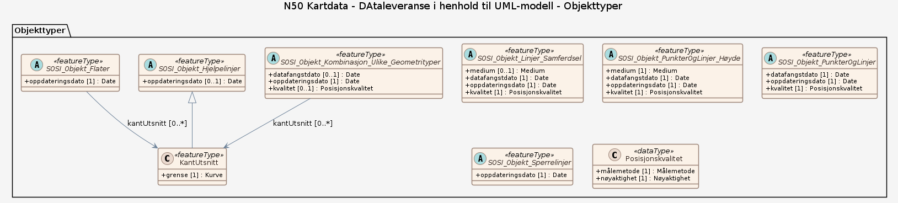

### Datamodell - DAtaleveranse i henhold til UML-modell

➡️ [Se full datamodell for omfang "DAtaleveranse i henhold til UML-modell" (diagram per pakke og objektkatalog)](dataleveranse-i-henhold-til-uml-modell/objektkatalog.html)
