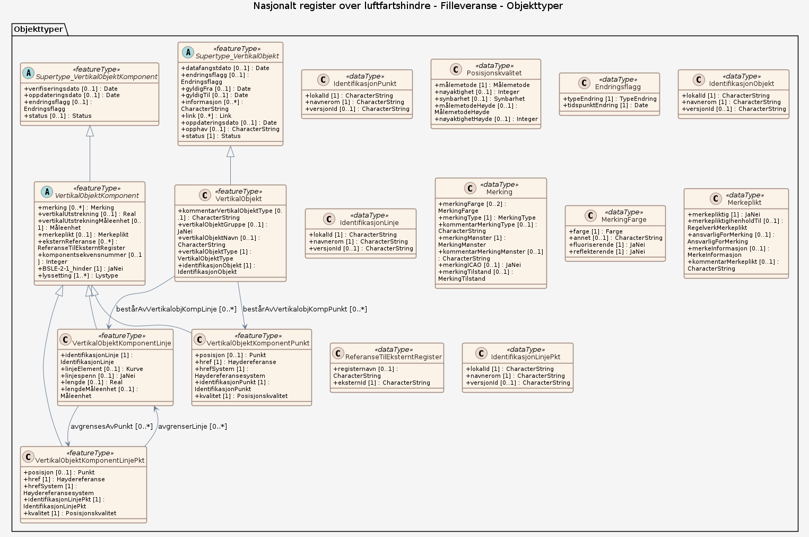

# Produktspesifikasjon: Nasjonalt register over luftfartshindre

*Nasjonalt register over luftfartshindre (NRL) inneholder luftfartshindre som er samlet inn som følge av "Forskrift om rapportering, registrering og merking av luftfartshinder". NRL inneholder posisjon og andre egenskaper for menneskeskapte objekter som stikker opp fra terrenget (master, tårn, kraner, kraftledninger m.m.). Hindre i NRL er representert som vektorer, enten punkter, linjer eller flater.

NB! Luftfartshinder under 15 meter med registreringsdato etter 3.7.2025 inngår ikke i de nedlastbare dataene. NRL-data er ikke komplett og må ikke benyttes til planlegging av flyvning.*

**Nøkkelord:** Luftfartshindre, NRL, Luftfartshinder, Nasjonalt register over luftfartshindre, Norge, Norsk kontinentalsokkel, Svalbard, Jan Mayen, Åpne data, beredskapsbase, Norge digitalt, modellbaserteVegprosjekter, fellesDatakatalog, Samferdsel, Hinder, Hindring, Lufthinder, SOSI_Fellesegenskaper, Fellesegenskaper, NrlLinje, NrlMast, NrlPunkt, NrlLuftspenn, NrlFlate, verifisertRapporteringsnøyaktighet, registreringsdato, historiskNrlId, vertikalAvstand, luftfartshindermerking, luftfartshinderlyssetting, materiale, høydereferanse, linjeType, beliggenhet, anleggsbredde, mastType, horisontalAvstand, punktType, luftspennType, flateType, luftfartshinderId, geometriId, datafangstmetode, datafangstmetodeHøyde

**Emnekategorier:** Konstruksjoner

**Tidsmessig utstrekning**:

- **Tidsperiode**:
  - **Fra**: 2014-04-01
  - **Til**: 2026-08-16

## Om spesifikasjonen
Denne produktspesifikasjonen beskriver datasettet og hvordan det skal forstås av brukere som skal lese, produsere eller utveksle data.

## Historikk

Første versjon.

## Endringslogg

| Versjon | Dato | Endring |
|---------|------|---------|

> **Denne versjonen av produktspesifikasjonen:**  
> **Opprettet dato:** 2014-04-01 
> **Endret dato:** 2026-08-16 
> **Språk:** nor 
> **Kontaktinformasjon:** Kartverket, [kundesenter@kartverket.no](mailto:kundesenter@kartverket.no)

## Om produktet Nasjonalt register over luftfartshindre

> **Romlig representasjonstype:** Vektor 
> **Unik identifikator:** <https://data.geonorge.no/sosi/samferdsel/luftfartshindre> 
> **Kontaktinformasjon:** Kartverket, [kundesenter@kartverket.no](mailto:kundesenter@kartverket.no)
>
> **Romlig oppløsning:**
>
> **Ekvivalent målestokk**: Ikke angitt
>
> **Begrensninger:**
>
> **Ressursbegrensninger**:
>
> - **Bruksbegrensninger**: Luftfartshinder under 15 meter med registreringsdato etter 3.7.2025 vises ikke. NRL-data er ikke komplett og må ikke benyttes til planlegging av flyvning.
>
> **Juridiske begrensninger**:
>
> - **Tilgangsbegrensninger**: Norge digitalt begrenset
> - **Bruksbegrensninger**: Lisens
> - **Lisens**: Norge digitalt-lisens
> - **Lisenslenke**: <https://www.kartverket.no/geodataarbeid/norge-digitalt/partsinformasjon/avtaler-og-vilkar/norge-digitalt-lisens>
> - **Andre begrensninger**: NRL er ment for bruk innen luftfarten. Kun berettigede parter gis tilgang. Kontakt Kartverket dersom du anser deg som en berettighet bruker og trenger tilgang.
>
> **Sikkerhetsbegrensninger**:
>
> - **Klassifisering**: Ugradert

### Formål

Nasjonalt register over luftfartshindre (NRL) inneholder luftfartshindre som er samlet inn som følge av "Forskrift om rapportering, registrering og merking av luftfartshinder".

### Bruksområde

Egnet til bruk i elektroniske kart- og varslingssystemer i fly og helikoptre. Siden dataene i tjenesten er etablert ved innmelding fra luftfartshindereierne kan Kartverket ikke garantere for kvaliteten på data i NRL.

## Omfang

### Hele datasettet

**Nivå**: dataset

**Nivåbeskrivelse**: Gjelder hele datasettet. Hvis omfang ikke er oppgitt under en overskrift, gjelder teksten for hele datasettet og alle leveranser

### Filleveranse

**Nivå**: dataset

## Datainnhold og struktur

### Datamodell - Filleveranse

➡️ [Se full datamodell for omfang "Filleveranse" (diagram per pakke og objektkatalog)](filleveranse/objektkatalog.html)

## Referansesystem

| EPSG-kode | Navn på referansesystem |
| --- | --- |
| [http://www.opengis.net/def/crs/EPSG/0/4258+3855](https://epsg.io///www.opengis.net/def/crs/EPSG/0/4258+3855) | [EUREF 89 Geografisk + EGM2008 høyde](https://register.geonorge.no/epsg-koder) |
| [EPSG:4937](https://epsg.io/4937) | [EUREF89 Geografisk, 2d + ellipsoide](https://register.geonorge.no/epsg-koder) |
| [EPSG:5942](https://epsg.io/5942) | [EUREF89 Geografisk + NN2000](https://register.geonorge.no/epsg-koder) |
| [EPSG:5972](https://epsg.io/5972) | [EUREF89 UTM sone 32, 2d + NN2000](https://register.geonorge.no/epsg-koder) |
| [EPSG:5973](https://epsg.io/5973) | [EUREF89 UTM sone 33, 2d + NN2000](https://register.geonorge.no/epsg-koder) |
| [EPSG:5975](https://epsg.io/5975) | [EUREF89 UTM sone 35, 2d + NN2000](https://register.geonorge.no/epsg-koder) |

## Datakvalitet

**Nivå**: dataset

- **Kvalitetsmål**: SOSI produktspesifikasjon: NRL - Nasjonalt register over luftfartshindre distribusjon
  **Målebeskrivelse**: Dataene er ikke vurdert iht produktspesifikasjonen
  **Beskrivende resultat**: Dataene er ikke vurdert iht produktspesifikasjonen

- **Kvalitetsmål**: Sosi applikasjonsskjema
  **Målebeskrivelse**: GML-filer er ikke vurdert i henhold til applikasjonsskjema
  **Beskrivende resultat**: GML-filer er ikke vurdert i henhold til applikasjonsskjema

## Datafangst og produksjon

**Datainnsamling og prosessering**:

- **Prosesstrinn**:
  - **Beskrivelse**:
    «Forskrift om rapportering, registrering og merking av luftfartshinder» (luftfartshinderforskriften) definerer hva som regnes for å være et luftfartshinder. Forskriften slår fast at den som eier et luftfartshinder er ansvarlig for å rapportere til NRL.

    Kartverket registrerer luftfartshindre i Nasjonalt register over luftfartshindre ut fra opplysninger i hindereiernes rapporter. Kartverket utfører også kontroller av datakvalitet så langt det er kapasitet til dette, men det må understrekes at registerets kvalitet i meget stor grad avhenger av at hindereierne faktisk overholder plikten til rapportering. Kartverket kan på ingen måte garantere at kravene til nøyaktighet i luftfartshinderforskriften er oppfylt for alle objekter i databasen. Videre er det usannsynlig at datasettet inneholder alle objekter som skal ligge i registeret. Registeret inneholder antakelig også hindre med ukorrekt status, for eksempel kondemnerte hindre som fremdeles er registrert med status «eksisterende». Andre feil kan også forekomme. Se produktspesifikasjonens kapittel 7 for mer informasjon om kvalitet.

## Vedlikehold

**Vedlikeholdsfrekvens**: Daglig

**Status**: Kontinuerlig oppdatert

## Presentasjon

**navn**: Tegneregler

**Lenke**:
<https://register.geonorge.no/tegneregler/nasjonalt-register-over-luftfartshindre-nrl>

## Leveranse

| Tjeneste | Endepunkt | Type | Format | Leveranseenheter |
| --- | --- | --- | --- | --- |
| Geonorge nedlastning | [Lenke](https://nedlasting.geonorge.no/api/capabilities/) | GEONORGE:DOWNLOAD | FGDB, GML, PostGIS | fylkesvis, landsfiler |
| Atom Feed | [Lenke](http://nedlasting.geonorge.no/geonorge/ATOM-feeds/Luftfartshindre_AtomFeedGML.xml) | W3C:AtomFeed | GML | fylkesvis, landsfiler |
| Atom Feed | [Lenke](http://nedlasting.geonorge.no/geonorge/ATOM-feeds/Luftfartshindre_AtomFeedPostGIS.xml) | W3C:AtomFeed | PostGIS | fylkesvis, landsfiler |
| UTGÅTT - Nasjonalt register over luftfartshindre WMS |  | WMS-tjeneste | png |  |

## Metadata

**Metadatastandard**: ISO19115

**Metadatastandardversjon**: 2003

**Metadatadato**: 2026-08-17

**språk**: nor

**Kontakt**:

- **Organisasjon**: Kartverket
- **Kontaktperson**: Geir Myhr Øien
- **Logo**: <https://register.geonorge.no/data/organizations/971040238_Kartverket_liten.png>
- **Epost**: kundesenter@kartverket.no
- **rolle**: pointOfContact

**Metadataidentifikator**:

- **Utsteder**: Geonorge
- **kode**: 28c896d0-8a0d-4209-bf31-4931033b1082
- **koderom**: <https://kartkatalog.geonorge.no/metadata/>
- **Metadatalenke**: <https://kartkatalog.geonorge.no/metadata/28c896d0-8a0d-4209-bf31-4931033b1082>

## Tilleggsinformasjon

Trenger du hjelp til å laste ned og ta i bruk Kartverkets data og tjenester? På kartverket.no finner du tips og veiledning.
